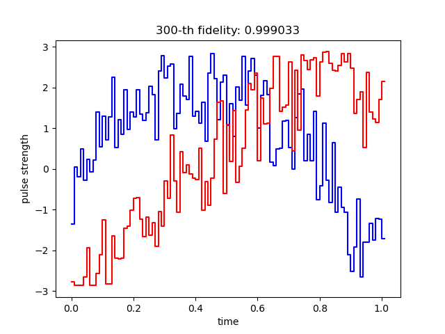
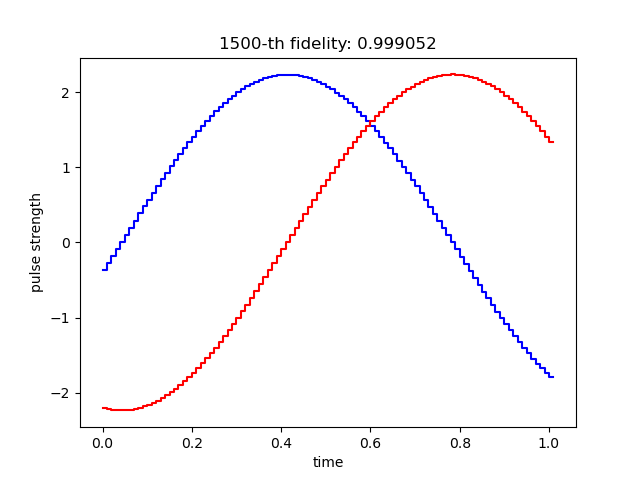
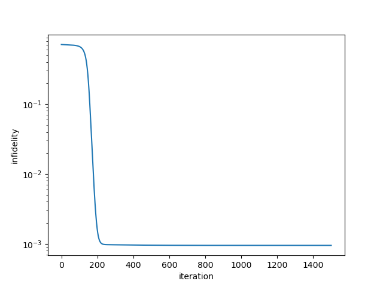

# GRAPE
An easiest demo of GRAPE (gradient ascent pulse engineering) algorithm of quantum control

# learned pulses
the learned pulses when the number of iterations is 300

the learned pulses when the number of iterations is 1500

# infidelity
